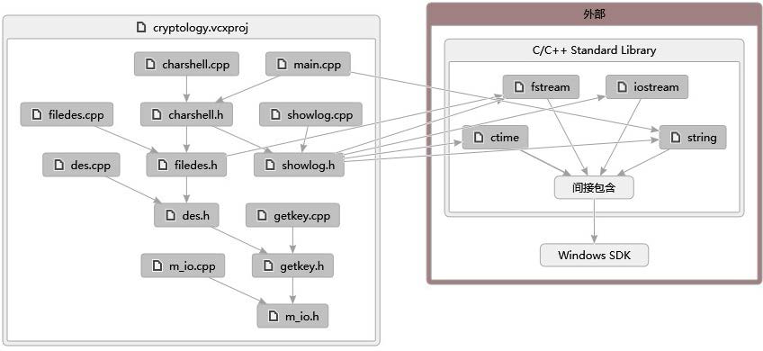
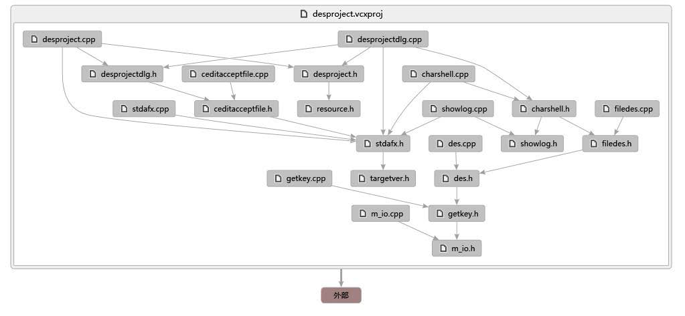
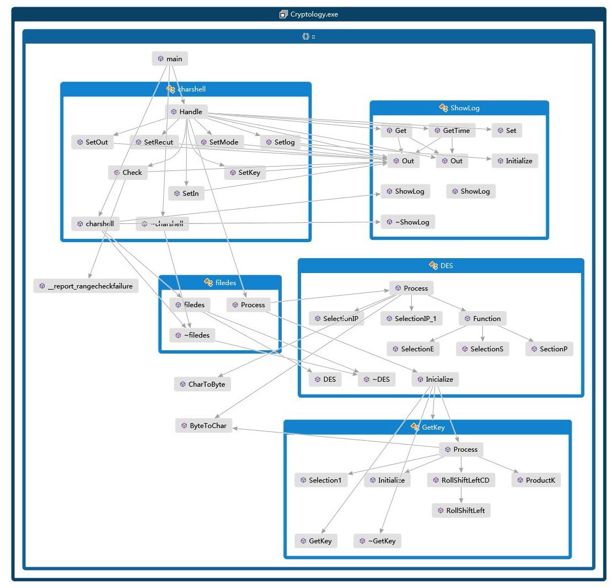

# DES encryption and decryption

*   `command-line` command line application

*   `MFC` MFC application

## Developer Dependencies

*   Visual Studio 2010/2012

## Usage

*   

    ### in command-line:

        des.exe <mode> <keyfile> <infile> [outfile] [reoutfile] [logfile]
        
        mode:
        1 encryption
        2 decryption
        3 encryption & decryption (check)
        
        key: path of key file (8 bytes)
        
        infile: input file
        
        outfile: output file
        
        reoutfile: decrypted file after encripted (used only in encryption & decryption mode)
    
    
    

*   

    ### MFC
    
    
    
## Code Map

*   

    ### command-line
    
    

*   

    ### MFC
    
    
    
## Class Map

*   
    ### command-line
    
    
    
*   
    ### MFC
    
    
